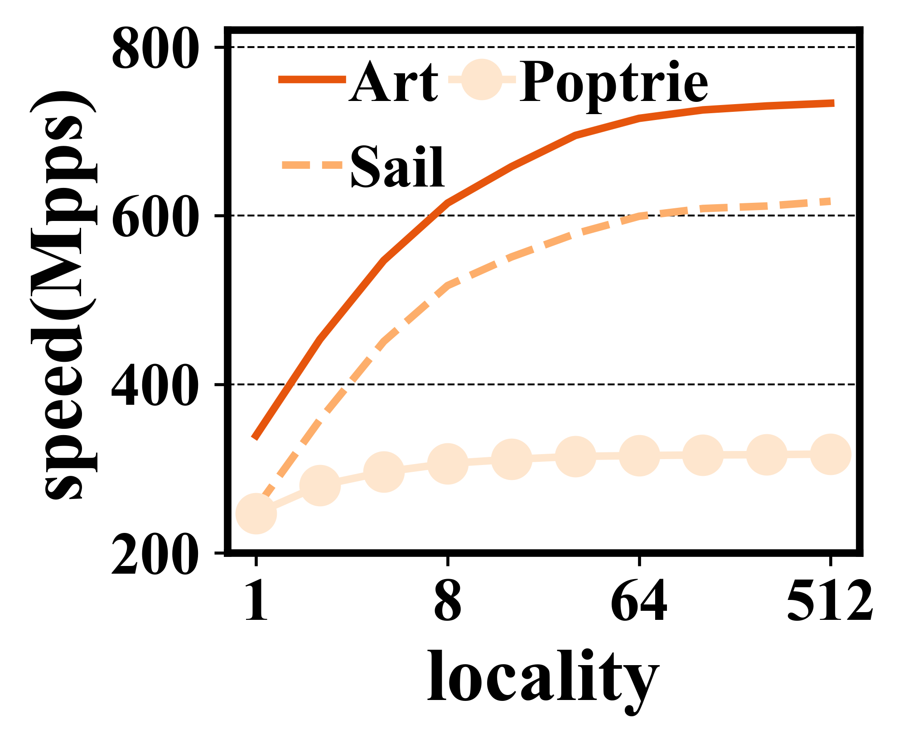
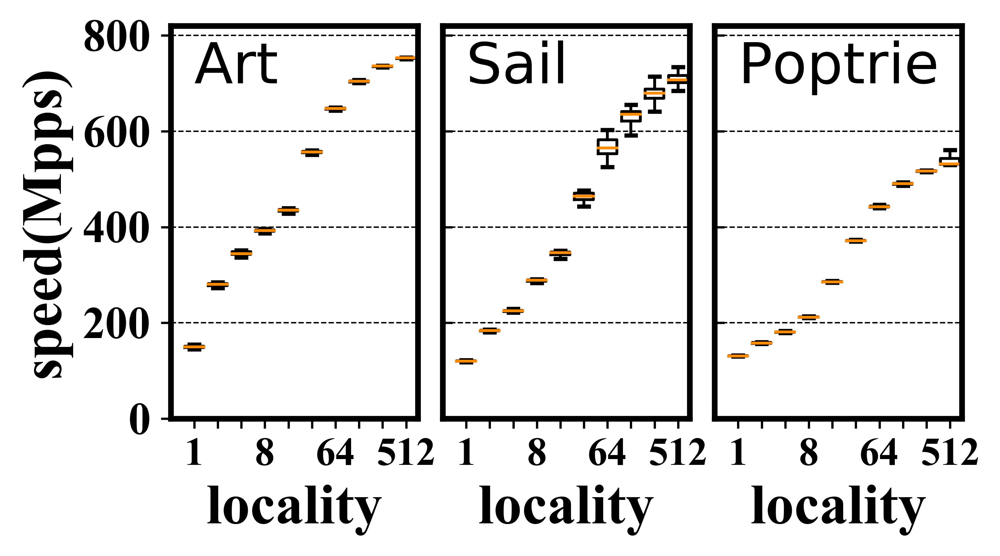
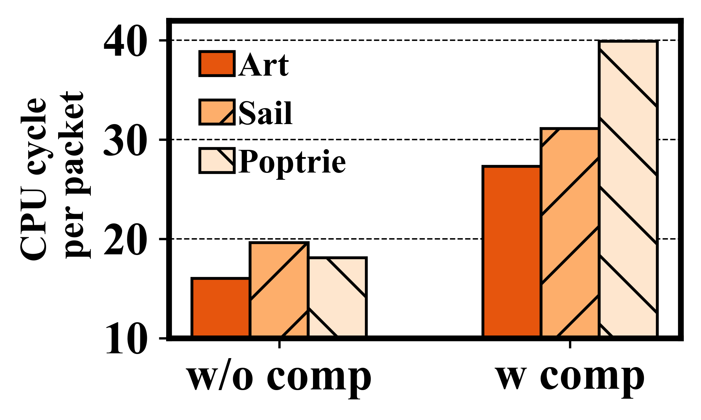
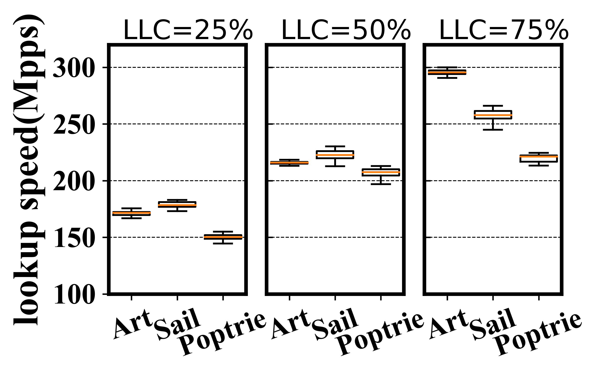

# 1. 数据格式

数据存储格式使用**CSV格式**。

# 2. 当前目录介绍

当前目录一共三个目录(datas,paper, result，example-picutre)和一些脚本文件（只需关注这些，其他的都是自动生成的一些文件）其中：

* **目录**：
  
    **datas/**：放置的是测试的数据；
    **paper/**：放置的是tex文件；
    **result/**：放置Python脚本生成的pdf图;
    **example-picture/**：存放的一些例子生成的图片

* **脚本**：
    **uitils**：工具类，比如读取csv文件，
    **其他脚本**：绘图脚本。

# 3. 例子说明

## 3.1. example1

## 3.2. example2

## 3.3. example3

## 3.4. example4

## 3.5. example5

## 3.6. example6

后序继续完成绘图的模块和更多的绘图样式例子。
更新中。。。。

