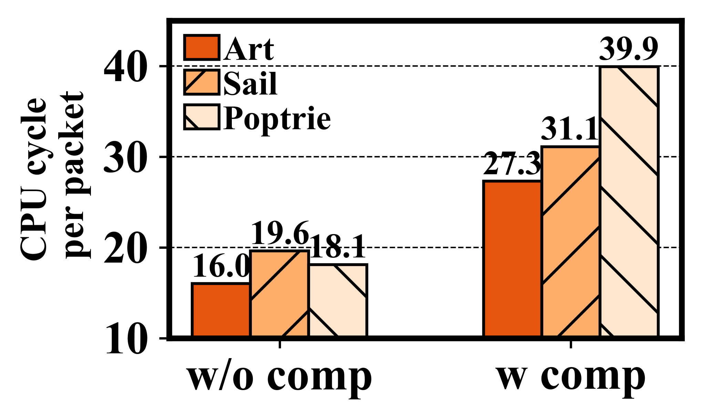

# 1. 数据格式

数据存储格式使用**CSV格式**。

# 2. 当前目录介绍

当前目录一共四个目录(datas, paper, result，example-picutre)和一些脚本文件（只需关注这些，其他的都是自动生成的一些文件）其中：

* **目录**：
  
    **datas/**：放置的是测试的数据；
    
    **paper/**：放置的是tex文件；
    
    **result/**：放置Python脚本生成的pdf图;
    
    **example-picture/**：存放的一些例子生成的图片

* **脚本**：

    **uitils**：工具类，比如读取csv文件，
    
    **font**：字体大小类。
    
    **plot**: 主要的绘图模块，封装了基本的绘图方法。可以在例子中直接调用该模块所列出来的方法。具体调用请参考所给出的例子。后序会继续完善该绘图模块，并会出去使用的例子。
    
    **其他脚本**：绘图的例子脚本。

# 3. 例子说明

## 3.1. example1

## 3.2. example2

## 3.3. example3

## 3.4. example4

## 3.5. example5

## 3.6. example6

## 3.7. example7

## 3.8. example8

## 3.9. example9

## 3.10. example10

**后序继续完善plot库和添加更多的绘图样式例子。**

**更新中。。。。**

